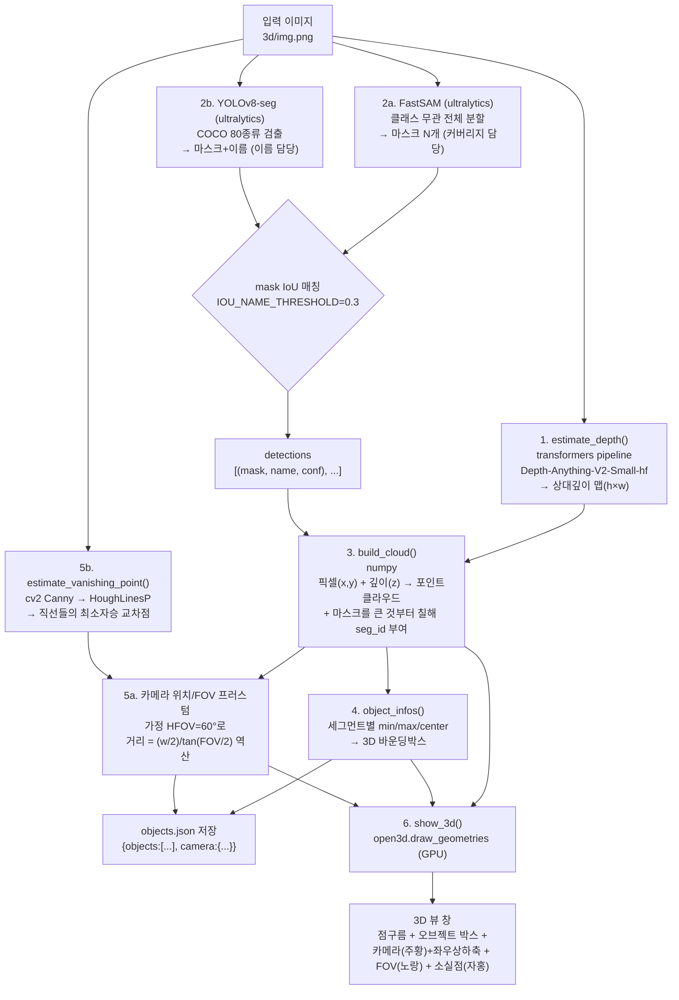

# 3d/ — 단일 이미지 → 3D 뷰 (깊이 + 세그멘테이션 + 카메라/FOV)

`view3d.py` 하나로, 사진 한 장에서 깊이를 추정하고 오브젝트별로 분할해서
Open3D 3D 뷰(GPU 가속, 마우스 드래그로 회전) 하나에 다 띄운다.

```
uv run python3 3d/view3d.py [이미지경로]   # 기본값: 3d/img.png
```

## 전체 flow



## 어떤 라이브러리로 무엇을 했나

| 라이브러리 | 여기서 맡은 역할 | 실제로 부른 API |
|---|---|---|
| `transformers` (HuggingFace) | 단안(monocular) 깊이 추정 | `pipeline("depth-estimation", model="depth-anything/Depth-Anything-V2-Small-hf")` |
| `ultralytics` — **FastSAM** | 클래스 구분 없이 이미지 전체를 분할 (커버리지) | `FastSAM("FastSAM-s.pt")(path)` → `result.masks.data` |
| `ultralytics` — **YOLOv8-seg** | COCO 80종류 이름 붙이기 (네이밍 전용) | `YOLO("yolov8n-seg.pt")(path)` → `result.boxes.cls/conf` |
| `numpy` | 좌표 변환/포인트클라우드/박스/최소자승 전부 | 픽셀↔3D 좌표 변환, `np.argsort`(마스크 크기순), `np.linalg.lstsq`(소실점) |
| `opencv-python (cv2)` | 소실점 추정용 직선 검출 | `cv2.Canny`, `cv2.HoughLinesP` |
| `open3d` | 3D 뷰 렌더링 (GPU/GLFW) | `PointCloud`, `AxisAlignedBoundingBox`, `TriangleMesh`(카메라 구·좌표축), `LineSet`(FOV 프러스텀), `draw_geometries` |
| `matplotlib` | 오브젝트 색 팔레트만 (뷰어로는 안 씀) | `plt.get_cmap("tab20")` |
| `Pillow (PIL)` | 이미지 로드 / 마스크 리사이즈 | `Image.open`, `Image.fromarray(...).resize()` |

## 단계별 설명

1. **깊이 추정** — `estimate_depth()`
   상대 깊이(미터 단위 아님) 맵을 이미지와 같은 해상도로 뽑는다. 값이 클수록
   카메라에 가깝다는 컨벤션(MiDaS 계열 공통)을 그대로 따른다.

2. **오브젝트 검출/분할** — `detect_objects()`
   - **FastSAM**으로 이미지 전체를 클래스 구분 없이 싹 다 분할 (커버리지 담당,
     84개 정도 잡힘 — YOLO 하나만 쓰면 COCO 80종류에 없는 조명/액자/쿠션 같은
     건 다 놓친다).
   - **YOLOv8-seg**로 별도 검출해서, FastSAM 마스크와 IoU(`IOU_NAME_THRESHOLD
     = 0.3`)로 겹치는 것만 그 이름을 물려받는다 (이름 담당). 안 겹치면
     `object_N`으로 둔다.
   - 즉 "커버리지는 FastSAM, 이름은 YOLO"로 역할을 나눠서 둘의 단점을 서로 보완.

3. **포인트클라우드 구성** — `build_cloud()`
   - `x = 픽셀x - 너비/2`, `y = 높이/2 - 픽셀y` (이미지 위쪽 = +y), `z = 깊이값
     스케일 조정` — 원근 투영을 실제로 계산하는 게 아니라, 픽셀 위치를 그대로
     x/y로 쓰고 깊이만 z로 얹는 **레이어형(2.5D) 근사**다. 진짜 카메라
     내부파라미터(초점거리 등) 없이도 바로 볼 수 있게 하는 절충안.
   - 마스크를 **큰 것부터 칠하고 작은 걸 나중에 덮어쓴다** — 순서대로 칠하면
     쿠션/꽃병처럼 작은 물체가 소파 같은 큰 마스크에 완전히 덮여서 포인트를
     하나도 못 받는 버그가 있었음 (`build_cloud`의 `order` 참고).

4. **오브젝트별 3D 박스** — `object_infos()`
   각 세그멘트의 포인트들에서 min/max/center 좌표를 뽑아 axis-aligned
   바운딩박스 정보를 만든다. 나중에 로봇 코드에서 좌표/이름을 읽어 쓸 수
   있도록 JSON으로 그대로 저장한다.

5. **카메라 위치 / FOV 프러스텀 / 소실점** — `main()` 후반부 + `estimate_vanishing_point()`
   - 실제 카메라 캘리브레이션 정보가 없어서, **수평 시야각(FOV)을 60°로
     가정**(`ASSUMED_HFOV_DEG`, 스마트폰/웹캠 표준 화각 근사치)하고 거기서
     `카메라~이미지평면 거리 = (너비/2) / tan(FOV/2)`를 역산해서 카메라
     위치를 정한다. 카메라는 항상 `(0, 0, 가장 가까운 점 깊이 + 위 거리)`에
     둔다 — 즉 재구성된 점들보다 한 발 앞(카메라 쪽)에 있다고 가정.
   - **소실점**은 OpenCV `Canny` 엣지 → `HoughLinesP` 직선 검출 → 각 직선을
     동차좌표 직선식(`ax+by+c=0`)으로 바꿔서 **최소자승으로 교차점**을 구하는
     단순한 방법. 방 안의 여러 소실점(수직/수평 등)을 다 분리하지 않고, 가장
     지배적인 교차점 하나만 잡는다.

6. **3D 뷰 렌더링** — `show_3d()` (Open3D `draw_geometries`)
   한 창에 다음을 전부 그린다:

   | 색 | 의미 |
   |---|---|
   | 회색/팔레트색 점 | 포인트클라우드 (미분할=회색, 분할된 오브젝트=`tab20` 팔레트) |
   | 팔레트색 박스 | 오브젝트별 3D 바운딩박스 |
   | 주황 구 | 카메라 위치 |
   | 빨강/초록/파랑 축 | 카메라 기준 좌우(X)/상하(Y)/정면(-Z) 방향 |
   | 노랑 선 | FOV 프러스텀 (카메라 → 이미지 네 모서리) |
   | 자홍 구 | 소실점 |

   드래그=회전, 스크롤=줌. 오브젝트 이름/좌표는 화면 텍스트가 아니라
   **콘솔 출력 + `objects.json`**으로 확인한다.

## 왜 이름/좌표 텍스트를 3D 화면 안에 안 넣었나

matplotlib 3D(mplot3d)로 점+박스+텍스트를 한 번에 그려본 적이 있는데,
mplot3d는 회전할 때마다 **CPU로 모든 점/선/텍스트를 매 프레임 다시 그려서**
오브젝트 80여 개 + 라벨만 있어도 회전이 심하게 버벅였다 (그래픽카드를
전혀 못 씀). 그래서 GPU 가속되는 Open3D로 옮겼다.

Open3D의 신형 GUI(`O3DVisualizer` + `add_3d_label`)는 3D 텍스트 라벨을
지원하긴 하는데, 이 macOS 환경에서 `app.run()` 도중 파이썬 예외로도 못
잡는 네이티브 크래시(창이 검게 깜빡이다 죽음)가 재현되어 포기했다. 그래서
안정적인 구형 API(`draw_geometries`)만 쓰고, 이름/좌표는 콘솔 + JSON으로
대체했다 — 로봇 코드에서 읽어 쓰기에는 오히려 구조화된 JSON 쪽이 더 유용하다.

## 출력 파일

- `objects.json` — `{"objects": [...], "camera": {...}}`
  - `objects[i]`: `seg_id`, `name`, `confidence`, `center_xyz`, `min_xyz`, `max_xyz`
  - `camera`: `position`, `frustum_corners`, `vanishing_point`, `marker_radius`, `assumed_hfov_deg`
- 모델 가중치(`FastSAM-s.pt`, `yolov8n-seg.pt`)는 실행 위치(cwd)와 무관하게
  항상 `3d/`에 받도록 고정(`WEIGHTS_DIR = Path(__file__).parent`) — IDE에서
  다른 cwd로 실행해도 안 깨지게 하기 위함. 둘 다 `.gitignore`에 있음.

## 알려진 단순화 (ponytail 표시)

- **원근 투영 미적용**: x/y는 픽셀 위치 그대로, z만 깊이 — 진짜 핀홀 카메라
  역투영이 아니라 레이어형 근사. 정확한 3D 복원이 필요하면 카메라 내부
  파라미터(초점거리)를 알아야 함.
- **FOV 60° 가정**: 실제 촬영 기기의 화각을 모르므로 고정값 사용. 실제
  화각을 알면 `ASSUMED_HFOV_DEG`만 바꾸면 됨.
- **소실점 1개만 추정**: 방 안에는 보통 소실점이 여러 개(수직선용, 두
  수평 방향용) 있는데 그걸 다 분리하지 않고 가장 강한 교차점 하나만 사용.
